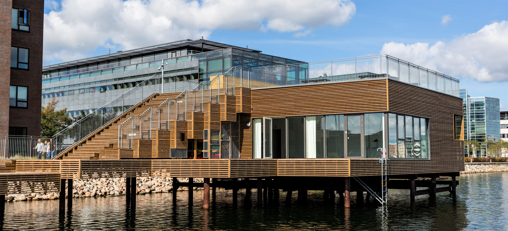
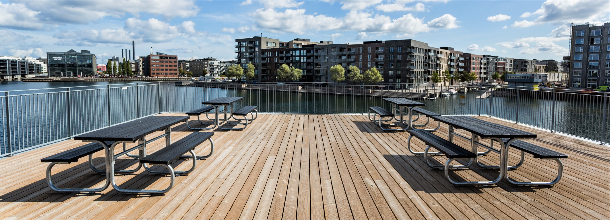
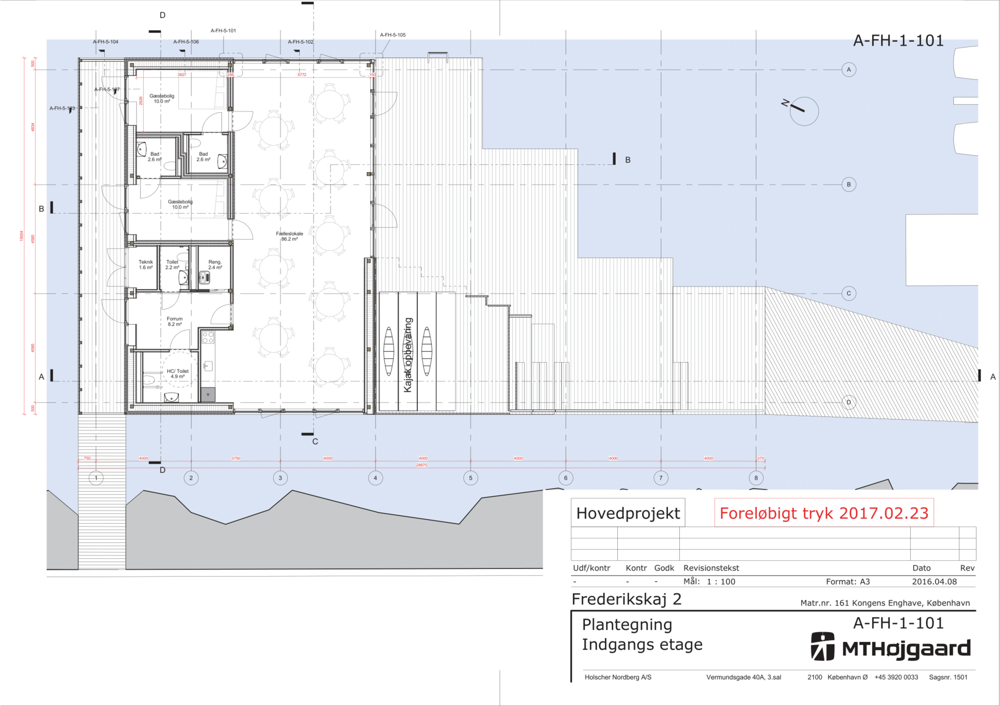

Frederikskaj 2 har et fælleshus som består af et aktivitets-/festlokale, samt to soveværelser med bad. Som beboer på Frederikskaj&nbsp;2 [kan man leje disse lokaler](https://lokaler.frederikskaj2.dk/).

Fælleshuset tag er indrettet med borde og bænke og et legeområde for børn. Området står til fri afbenyttelse for beboere og deres gæster. Området er bag en låge som skal holdes aflåst for at undgå at området invaderes af uvedkommende (benyt din universalnøgle til Frederikskaj&nbsp;2).

I modsætning til lokalerne i fælleshuset er taget ikke et område man kan reservere. Man skal endvidere overholde de samme regler som gælder for resten af fælleshuset med hensyn til støjende adfærd: der skal være ro efter kl. 21:00 på hverdage og kl. 23:00 i weekender.

Under trappen op til taget findes [kajaklaugets](../kajaklaug/) materiel.

