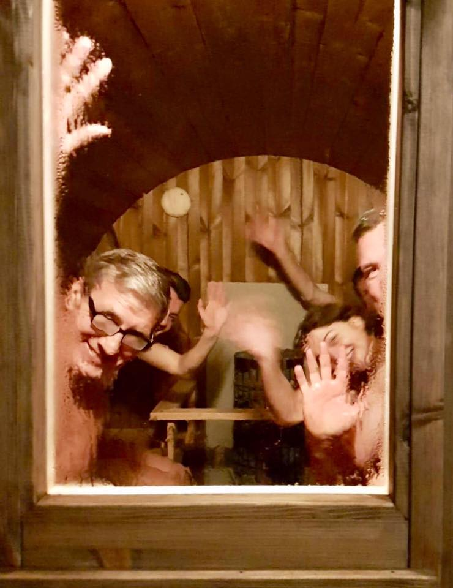
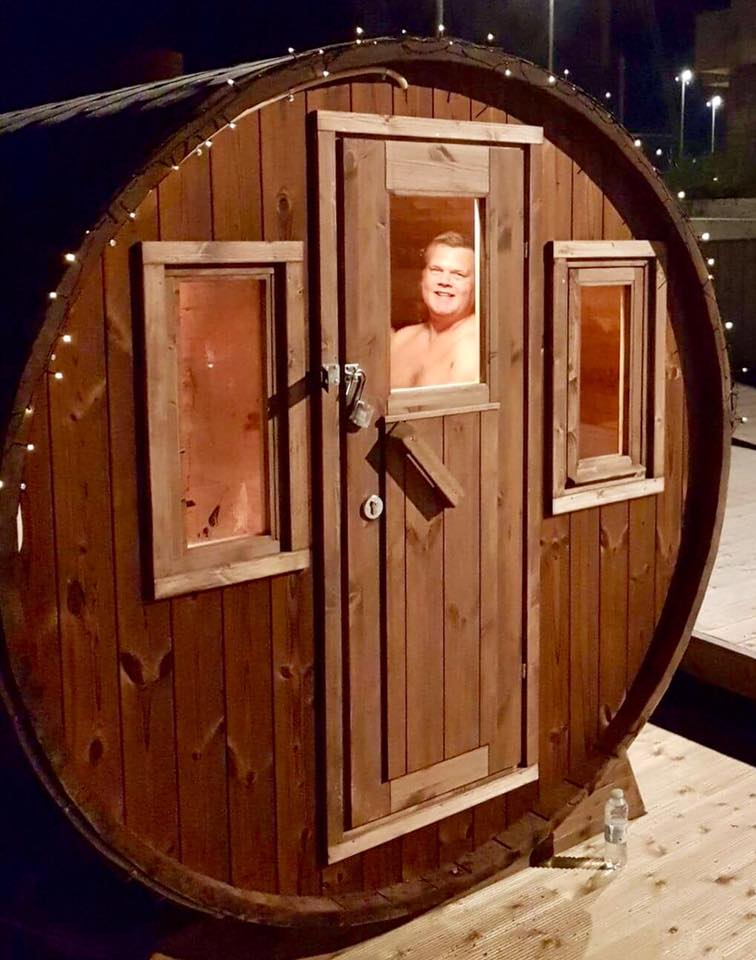
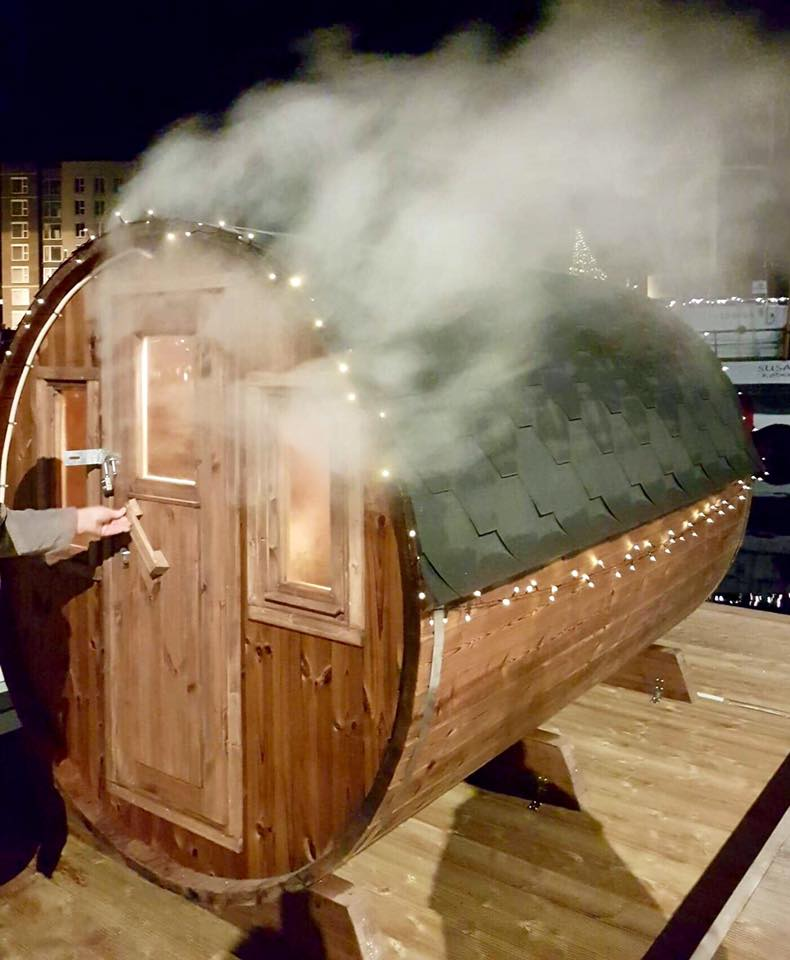

Vinterbadelaugets sauna er placeret mellem fælleshuset og husbådene, lige over for vinterbadernes foretrukne vinterbader-badestige. Saunaen er med eldrevet saunaovn, og strøm til den hentes fra el-standeren, som står på badebroen tæt ved.

Som medlem får du udleveret et el-kort, som er personligt og ikke må overdrages til andre. Med el-kortet styrer du selv dit forbrug, og du kan selv bestemme, hvornår du vil benytte saunaen alle ugens dage i tidsrummet fra kl.&nbsp;06.30 til kl.&nbsp;22.00

Som et særligt tilbud til medlemmer holder Vinterbadelauget åben sauna hver søndag fra 10.30 til&nbsp;12.00 og onsdag aften fra 19.30 til&nbsp;20.30, hvor saunaen er opvarmet og til fri benyttelse. Tilbuddet gælder i februar og marts 2020.

## Medlemskab

Alle beboere på Frederikskaj&nbsp;2, der er fyldt 18 år, er velkomne som medlemmer. Omfattet er også de bådpladslejere, som ikke bor på Frederikskaj 2. Medlemmer, der er fraflyttet bebyggelsen, kan beholde deres medlemskab.

Medlemskabet er personligt og koster 500&nbsp;kr. for en sæson plus 250&nbsp;kr. i indmeldelsesgebyr, hvoraf 100&nbsp;kr. er sat ind på el-kortet.

Som medlem må du tage en gæst med i saunaen. Du har også mulighed for at booke saunaen til din egen private event. Det koster 250&nbsp;kr. for 1½&nbsp;time.

## Sponsorat

Som firma kan du tegne et sponsorat, hvorved dit firmanavn bliver eksponeret, samtidig med at du støtter et godt formål om at skabe socialt engagement i nærområdet. Med et sponsorat får du ret til et event af 1½&nbsp;times varighed i saunaen per sponsor-år.

### Sponsorer

- CANI Shipping

## Betalinger

Vinterbadelauget har egen MobilePay konto 791586 (Vinterbadelauget Frederikskaj&nbsp;2), der skal benyttes til betalinger for events, el-køb eller indmelding.

## Kontakt

Kontakt for yderligere information og indmeldelse: [vinterbadelaugetfrederikskaj2@gmail.com.](mailto:vinterbadelaugetfrederikskaj2@gmail.com.)

Formand: Søren Peder Sørensen; 20&nbsp;27&nbsp;85&nbsp;16

Kasserer: Claus Mikkelsen; 21&nbsp;94&nbsp;26&nbsp;98; MobilePay 791586

For påfyldning af el-kort: Karen-Lise Christensen; [karen_lise@yahoo.dk](mailto:karen_lise@yahoo.dk)

Vinterbadelauget har sin egen [Facebook-gruppe](https://www.facebook.com/groups/251798845424659/) med løbende opdateringer og med mulighed for booking af event.

