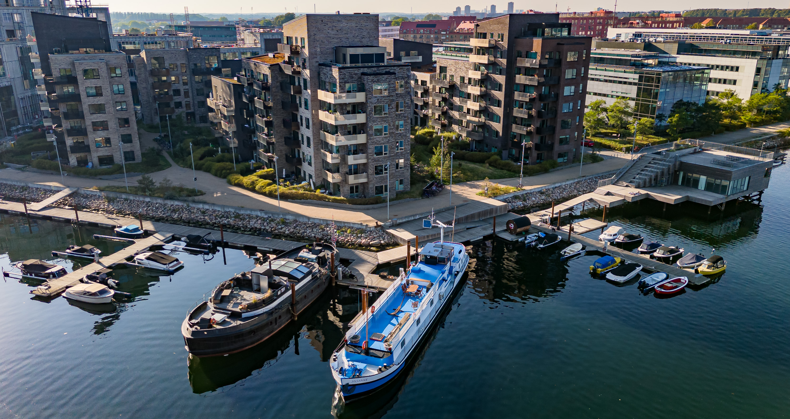
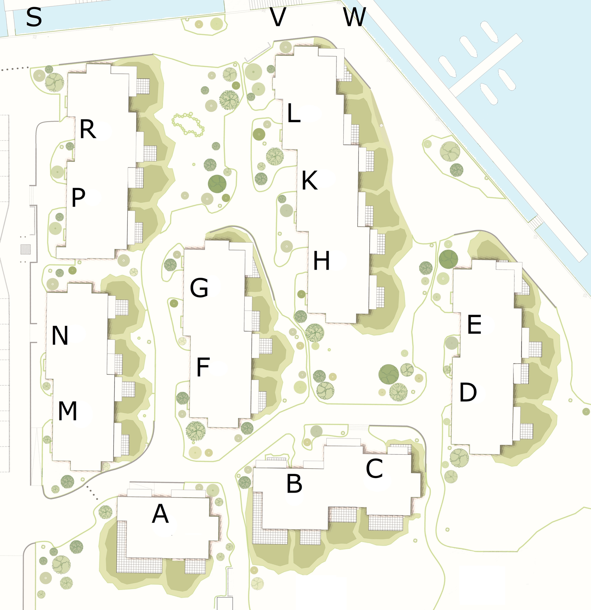

[Ejerforeningen Frederikskaj&nbsp;2](https://datacvr.virk.dk/data/visenhed?enhedstype=virksomhed&id=38016938&soeg=38016938&language=da) består af 81&nbsp;ejerlejligheder i opgangene 2D, 2E, 2H, 2K, 2L, 2P &&nbsp;2R i tre boligblokke på Frederikskaj&nbsp;2, 2450 København&nbsp;SV. De øvrige fire boligblokke med opgangene 2A, 2B, 2C, 2F, 2G, 2M &&nbsp;2N består af lejelejligheder ejet af PFA. Sammen er disse med ejerlejlighederne, samt to husbåde, organiseret i [Grundejerforeningen Frederikskaj&nbsp;2](https://datacvr.virk.dk/data/visenhed?enhedstype=virksomhed&id=38030329&soeg=38030329&language=da). Byggeriet er opført af [MT&nbsp;Højgaard](https://mth.dk/Vores-Projekter/Frederikskaj-2).

Grundejerforeningen råder over et fælleshus, med festlokale samt to soveværelser, som kan lejes samlet eller separat af beboerne. Fælleshusets tagterrasse er indrettet med borde-/bænkesæt, legeområde, plads til solbaderne, samt (med tiden) simpelt fitness udstyr. Derudover har grundejerforeningen 26&nbsp;bådpladser, som ligeledes kan lejes af beboerne.

Grundejerforeningen udlejer »kajakhotellet« ved fælleshuset til Frederikskaj&nbsp;2s kajaklaug, samt plads i marinaen til den flydende sauna som ejes af Frederikskaj&nbsp;2s vinterbadelaug.

## Bebyggelsen

Frederikskaj&nbsp;2 er et anderledes og nytænkende miljø, hvor det maritime videreføres fra havnen og helt ind mellem boligerne. De fælles arealer er derfor ikke bare et traditionelt grønt område. Trimmede hække og plæner er erstattet af smukke kystplanter, som f.eks. havtorn, fyr, strandroser og strandgræsser. Bebyggelsen er anlagt i et bølgende bakketerræn, som er stærkt inspireret af klitterne ved de danske kyster. Det kystinspirerede landskab fungerer som en naturlig forlængelse af det autentiske havnemiljø, og nærheden til vandet kan mærkes.

Fokus har været på variation, oplevelser og en stor åbenhed, der leder indtrykkene fra vandet rundt i bebyggelsen. Frederikskaj&nbsp;2 består af en række selvstændige bygninger, der hver især har karakter af et klassisk byhus. Denne form bryder med det traditionelle stramme karrebyggeri, som man ellers ser i meget af tidens nybyggeri.

Husene er opført med varierende etagehøjder samt forskudte facader, hvilket er med til at optimere udsigten til vandet fra hver bolig. Den afvekslende form bidrager desuden med et levende udtryk, der giver oplevelser for øjet.

Frederikskaj&nbsp;2 er desuden energioptimeret med bl.a. 3-lags energiruder og solceller på tagene, der gør bygningerne mere miljøvenlige. [Energimærkningen](/ejerforeningen/energimaerke/) er A2015.

## Oversigtskort

## Placering på kort

  <iframe title="Kort som viser Frederikskaj 2" src="https://www.openstreetmap.org/export/embed.html?bbox=12.542832791805269%2C55.64571959790351%2C12.546005845069887%2C55.64763575992391&amp;layer=mapnik&amp;marker=55.646677690633034%2C12.544419318437576" loading="lazy"></iframe>

[Vis større kort](https://www.openstreetmap.org/?mlat=55.64668&amp;mlon=12.54442#map=19/55.64668/12.54442&amp;layers=N)
