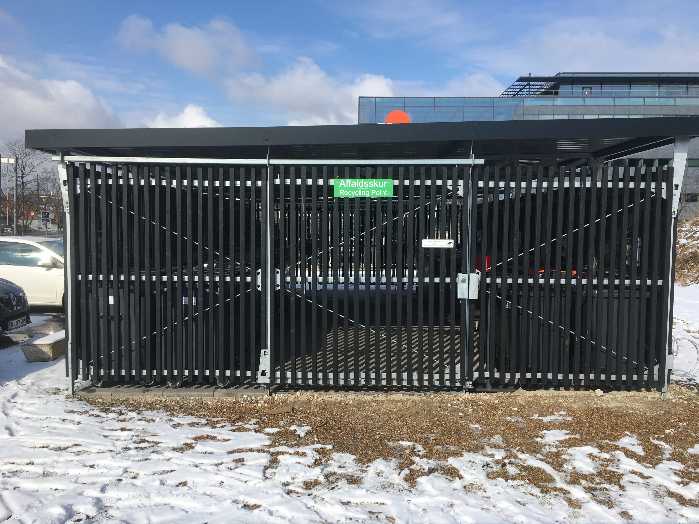

Affald som ikke håndteres korrekt kan føre til ekstra udgifter, ikke bare for den beboer som har smidt sit affald, men for os alle sammen, så vær venlig at overholde nedenstående.

## Affaldssortering

Affald skal sorteres i syv forskellige slags. Du finder de forskellige containere i affaldsskuret:

- [Pap](https://www.kk.dk/artikel/sortering-af-pap)
- [Plast](https://www.kk.dk/artikel/saadan-sorterer-du-dit-plastaffald)
- [Papir](https://www.kk.dk/artikel/sortering-af-papir)
- [Metal](https://www.kk.dk/artikel/sortering-af-metal)
- [Elektronik](https://www.kk.dk/artikel/sortering-af-elektronik)
- [Bioaffald](https://www.kk.dk/artikel/saadan-sorterer-du-dit-bioaffald)
- [Glas](https://www.kk.dk/artikel/sortering-af-glas)

Bemærk at glascontaineren står udenfor affaldsskuret ved indkørselsvejen til bebyggelsen.

Containerne i affaldsskuret må ikke overfyldes.

Specielle affaldsposer til bioaffald kan [bestilles gratis hos Københavns Kommune](https://www.kk.dk/bioposer). De kan også afhentes på [Sydhavn Genbrugscenter](https://sydhavngenbrugscenter.kk.dk/) og kommunale biblioteker.

Hvis du er i tvivl om hvordan et specifikt stykke affald skal sorteres kan du søge i [Affalds-ABC](https://nemaffaldsservice.kk.dk/AffaldsABC).

## Restaffald

Det affald som ikke kan sorteres er [restaffald (dagrenovation)](https://www.kk.dk/artikel/saadan-sorterer-du-dit-restaffald-dagrenovation) fx:

- Mælkekartoner
- Pizzabakker
- Bleer
- Hygiejneaffald
- Flamingo
- Snasket papir eller pap

Al affald som smides i affaldsskakten skal være forsvarligt emballeret i en plastpose på maksimalt 20 liter som er lukket med snøreluk.

Affald som ikke kan komme i affaldsskakten skal i stedet puttes i containeren i affaldsrummet ved siden af opgangen hvor affaldsskakten ender. Anvend den container som står under skakten og ikke en eventuel tom container som står ved siden af.

Pizzabakker kan ikke komme i affaldsskakten med mindre de er klippet i mindre stykker og puttet i en pose.

## Storskrald og farligt affald

Al affald som ikke kan sorteres og som ikke kan være i en container til restaffald samt farligt affald skal afleveres på en genbrugsstation.

Nærmeste genbrugsstation er [Sydhavn Genbrugscenter](https://sydhavngenbrugscenter.kk.dk/), Bådehavnsgade 50, 2450 København SV, afstand ca. 1&nbsp;km.

  <iframe title="Kort som viser Sydhavn Genbrugscenter" src="https://www.openstreetmap.org/export/embed.html?bbox=12.528083324432375%2C55.63124243188086%2C12.55140781402588%2C55.64645368368984&amp;layer=mapnik&amp;marker=55.63884879609704%2C12.539734840393066" loading="lazy"></iframe>

[Vis større kort](https://www.openstreetmap.org/?mlat=55.6388&amp;mlon=12.5398#map=16/55.6388/12.5398&amp;layers=N)
