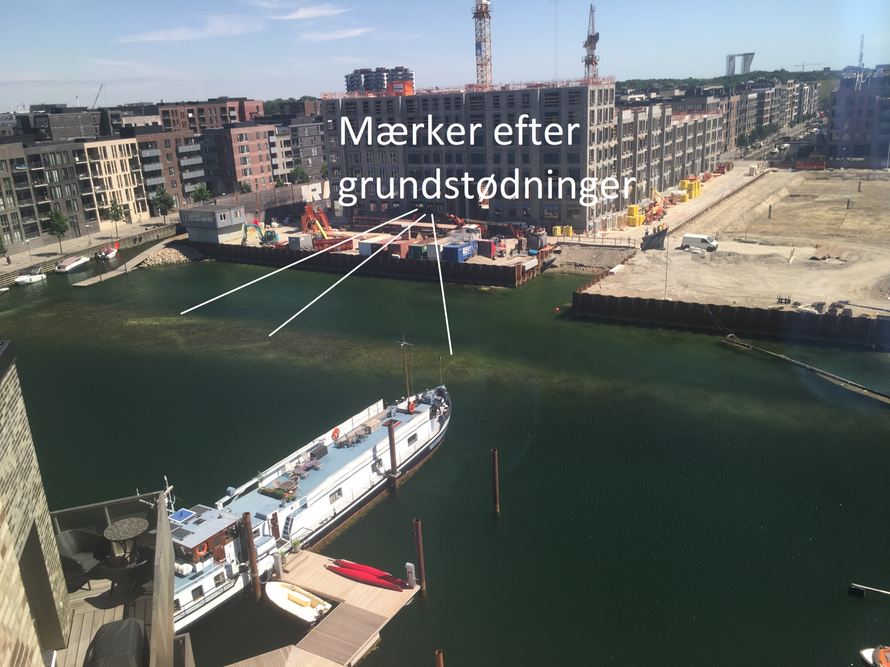

Grundejerforeningen Frederikskaj&nbsp;2 har 26 bådpladser, bestående af:

- 14 pladser til både af max. 6,4 meter (21 fod) i længden og 2,5 meter i bredden.
- 12 pladser til både af max. 8,2 meter (27 fod) i længden og 2,75 meter i bredden.

Pladserne udlejes primært til grundejerforeningens beboere, under betingelser som benævnt i [lejekontrakten](lejekontrakt/) samt [reglerne](regler/).

Desuden er det muligt at udleje til »ikke-beboere«. Dette sker til samme pris som til beboerne. Beboere på Frederikskaj&nbsp;2 her dog fortrinsret til bådpladserne, så derfor kan pladser udlejet til »ikke-beboere« blive opsagt, med 3&nbsp;måneders varsel, til enden af et 12&nbsp;måneders lejeår, såfremt der er beboere på ventelisten.

Der vil blive holdt en venteliste for beboere Frederikskaj&nbsp;2, men **ikke** en for »ikke-beboere«.

## Priser

Lejepriserne er:

- Kr.&nbsp;500/måned for små pladser, betalt 12&nbsp;måneder forud.
- Kr.&nbsp;550/måned for store pladser, betalt 12&nbsp;måneder forud.

Derudover skal der betale et depositum på 6&nbsp;måneders leje.

Ved indgåelse af [lejekontrakt](lejekontrakt/) opkræver administrator et engangbeløb på kr.&nbsp;745 til dækning af administrationsomkostninger.

## Kontakt

Udlejning og venteliste bestyres af Sjeldani Boligadministration som kan [kontaktes her på siden](/kontakt/baadpladser).

## Lav vanddybde - pas på!

