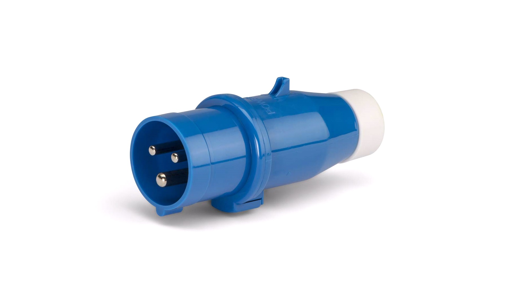

## Vand

Der er vandhaner på siden af el-standerne på begge bådebroer. Vand bliver ikke direkte betalt af bådejerene efter forbrug, men indirekte via en lille overpris på elforbruget fra el-standerne. Vandhanerne er af en udendørstype, hvor der skal bruges en plastnøgle for at åbne og lukke dem. En nøgle udleveres gratis, hvis du vælger at få lavet et forbrugskort til el-standerne (se nedenfor). Hvis du mister plastnøglen, så koster en ny kr.&nbsp;50.

## Elektricitet

For at få adgang til elektricitet skal man bruge et kort (a&nbsp;la Rejsekortet):

- Der er ét kort per bådplads. De er nummeret fra 1–26. Kortet udleves gratis når I første gang »tanker op« på det. Minimum optankningsbeløb er kr.&nbsp;50.
- Hvis I mister kortet, så koster det kr.&nbsp;50 at få et ny kort, samt tab af beløbet som evt. var på det kort som er bortkommet.
- Der kan indsættes yderligere forbrugsbeløb på kortet imod betaling, enten kontant eller via MobilePay. Mindstebeløb er kr.&nbsp;50.
- Prisen på el via standerne er kr.&nbsp;2,50 per&nbsp;kWh. hvilket er en smule over markedsprisen.
- Udleveringen af forbrugskort og plastnøgler, samt optankning på forbrugskortene, styres af repræsentant for Vinterbadelauget, Søren Peder Sørensen, som kan kontaktes via mail: [spsfreelance@mail.dk.](mailto:spsfreelance@mail.dk.) Søren Peder afregner løbende elforbruget med grundejerforeningen.

### Betjening af el-standerne

Det er meget lige til. Der er klare instruktionerne på skærmen, som er nogenlunde sådan her:

- Indsæt kort (I vil nu kunne se saldo på Jeres kort).
- Vælg hvilket el-udtag/stik som I vil bruge.
- Maskinen trækker kr.&nbsp;10, hvilket svarer til 4&nbsp;kWh. I kan også vælge 2,&nbsp;3 eller 4&nbsp;×&nbsp;kr.&nbsp;10&nbsp;osv.
- Tag kortet ud og brug el.
- Når I er færdig med at bruge el (måske skal der bare støvsuges), så sætter I kortet tilbage i maskinen og trykker på *Tøm*. Så stopper strømmen til stikket, og de penge (ud af de kr.&nbsp;10, eller mere) som I ikke har brugt bliver tilbageført til kortet.

En vigtig ting! I kan ikke bruge almindelige stik (som på mobilopladeren, stiksaven eller støvsugeren). I skal bruge et CEE&nbsp;17 stik, da der skal være ekstra afskærmning i et marinemiljø. I skal derfor bruge en adapter, som f.eks. dette [adapterkabel 0,4&nbsp;m CEE -> Schuko](https://www.thansen.dk/vaerktoj/elartikler/adapterkabel-0-4-m-cee-schuko/n469333184/pn-244693619).

