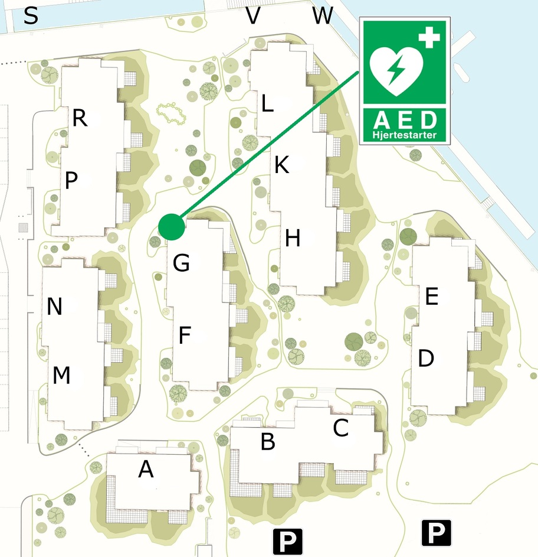

Frederikskaj&nbsp;2 blev, efter ansøgning fra bestyrelsen, i starten af 2018 tildelt en hjertestarter af TrygFonden. Hjertestarteren blev i juni opsat på den vand-vendte gavl i bygningen i midten af Frederikskaj&nbsp;2, lige ved Opgang&nbsp;G.

Udover hjertestarteren har TrygFonden også, meget venligt, tildelt Frederikskaj&nbsp;2 en pose penge som er blevet brugt til sikkerhedskurser til beboerne. Dette hovedsageligt pga. Frederikskaj 2s beliggenhed ned til vandet, og beboernes hyppige brug af samme. 

Hvis man har modtaget uddannelse i en hjertestarter (og gerne vil hjælpe andre), så opfordres beboerne til at hente appen [Hjerteløber](https://hjertestarter.dk/hjerteloeber).