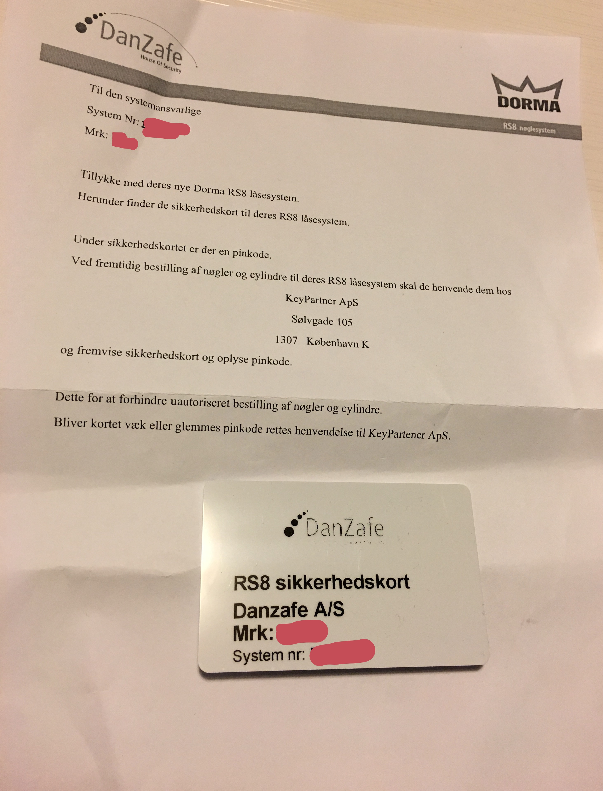
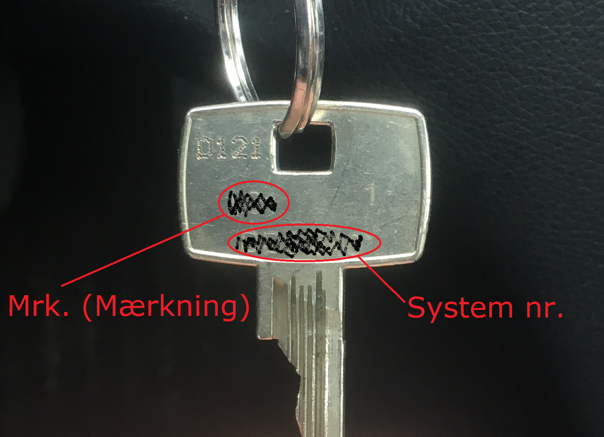

## »Postnøgler«

Der har været forespørgsler fra beboere omkring udlevering af »postnøgler« (som giver adgang til opgangene) til madtjenester, som Årstiderne og andre leverandører af måltidskasser. Bestyrelsen godkender ikke udlevering af sådanne postnøgler.

## Hoveddørs-/gadedørsnøgler

Det er beboernes eget ansvar at holde styr på og bestille nøgler.

Nøgler kan bestilles ved [Key Partner](https://keypartner.dk/system/).

Ved bestilling af nøgler skal du bruge brevet fra DanZafe, eller det RS8 Sikkerhedskort fra DanZafe og medfølgende pinkode (som findes i brevet fra DanZafe), som tilhører hver lejlighed. Med disse oplysninger kan du bestille ekstra nøgler [online hos Key Partner](https://keypartner.dk/system/).

Informationen som du skal bruge er:

- **Mrk. (Mærkning)**: Står på både sikkerhedskort, i toppen af brevet, samt dine nuværende nøgler. Dette er dit lejlighedsnummer, f.eks. »L59«.

- **Pinkode**: Står i brevet, og er formodentligt på fem cifre.

- **System nr.**: Står på både sikkerhedskort, i toppen af brevet, samt dine nuværende nøgler.

Er brevet, kortet eller pinkoden blevet væk skal du rette henvendelse til Key Partner.

