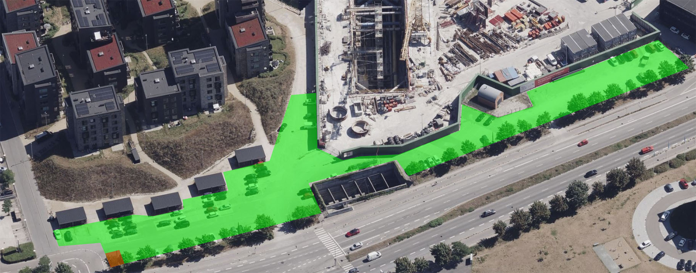
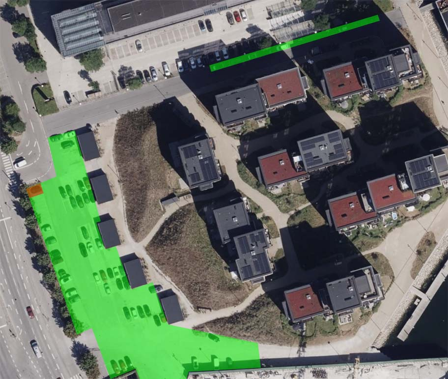
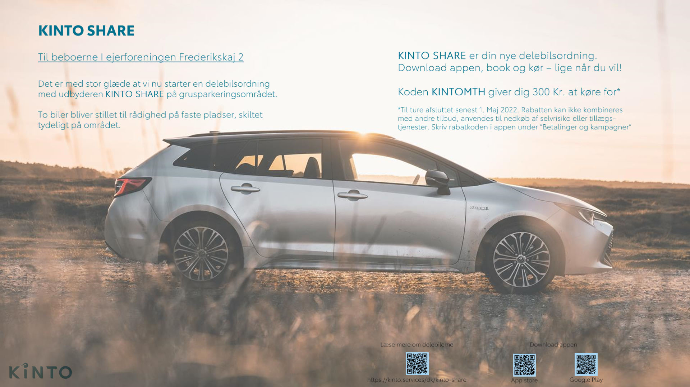

## Parkeringsregler

Der er parkeringsregler på/ved Frederikskaj&nbsp;2. Disse fremgår ved tydelig skiltning, og de bliver håndhævet af [COPARK](https://copark.dk/). Se nedenfor for billeder af arealet hvor der kan parkeres.

### COPARK-app

Beboerne kan parkere gratis, hvis deres køretøj er registreret i COPARKs app til mobiltelefon ([Android](https://play.google.com/store/apps/details?id=no.giantleap.parko.copark)/[iPhone](https://apps.apple.com/dk/app/copark/id1503185040?l=da)). Hver lejlighed har adgang til to permanente parkeringstilladelser enten knyttet til ét telefonnummer eller fordelt på to telefonnumre. Når et telefonnummer er registeret, kan man også registrere køretøjer tilhørende gæster, håndværkere og lignende, som dermed kan holde gratis i 24&nbsp;timer. Man behøver ikke at eje et køretøj for at blive registeret hos COPARK, og dermed har alle beboere mulighed for at oprette midlertidige tilladelser til deres gæster.

### Registrering i app

Som **ejer** på Frederikskaj&nbsp;2 kan man få registreret sit telefonnummer ved at henvende sig til [ejerforeningens bestyrelse](/kontakt/ejerforeningen/) og oplyse **navn**, **adresse** og **telefonnummer**. Som **lejer** skal man kontakte sin udlejer for at blive registreret. Bemærk at man skal forvente en vis sagsbehandlingstid fra man henvender sig til man får tilladelsen.

### Parkering med p-skive

Desuden er der gratis parkering i to timer, såfremt parkeringsskiven er korrekt indstillet.

### Handikap-pladser

Frederikskaj&nbsp;2 har fem handikap-pladser, som er klart opmærket. Tre ud for opgang&nbsp;2R, og to ved indkørslen til parkeringspladsen. Her må der kun parkeres, hvis man har et gyldigt handikapskilt i forruden. Parkering på handikap-pladserne er derudover underlagt de samme parkeringsregler som resten af området.

### Delebils-pladser

Frederikskaj&nbsp;2 har endvidere to delebils-pladser ved indkørslen (se nedenfor). Disse pladser er reserveret til delebiler fra [Kinto Share](https://kinto.services/dk/kinto-share).

## Ingen kørsel i bebyggelsen

Generelt er al motorkørsel inde i bebyggelsen forbudt, som også markeret med skilte ved indkørselsvejene, og derfor er den indre del af bebyggelsen afspærret. Undtagelsen er dog, hvis man har indhentet tilladelse i forbindelse med flytning eller andet.

Ved ind- og udflytning, eller f.eks. aflæsning af større møbler, kan man kontakte [viceværten](/kontakt/vicevaert/) for tilladelse til at køre ind og parkere på vejene foran bygningerne. Viceværten ville i så fald kunne hjælpe med at fjerne pullerterne ved hovedindkørslen. Flyttebiler og lignende skal benytte en fysisk parkeringstilladelse placeret i forruden. Viceværten kan udlåne denne, men anmodning om dette skal ske mindst fem dage før den skal benyttes.

Det er dog aldrig tilladt at køre ind på eller over græs og bede, og en gartnerregning vil følge hvis dette sker.

## Parkeringsareal

Området hvor man som beboer på Frederikskaj&nbsp;2 kan parkere er markeret med grønt på billederne. De to reserverede delebilspladser er markeret med rødt.

## Fremtidig parkering

Det nuværende areal hvor der kan parkeres bliver i midten af 2022 inddraget da området skal bebygges. MT&nbsp;Højgaard arbejder på alternative parkeringsmuligheder i området for beboerne på Frederikskaj&nbsp;2. Når byggeriet er færdigt, vil man som beboer (mod betaling) kunne få adgang til en parkeringsplads i det nye byggeri.

## Delebilsordning

import referat20220119 from './informationsmoede-om-parkering-2022-01-19.pdf'
import Link from '@material-ui/core/Link'

Ejerforeningen afholdte den 19.&nbsp;januar 2022 et informationsmøde hvor MT Højgaard orienterede om de fremtidige planer for parkering (se <Link href={referat20220119} color="secondary" target="_blank">referat</Link>). I den forbindelse tilbød de en delebilsordning som en del af den endelige parkeringsløsning. Ejerforeningens bestyrelse har sagt ja tak til at afprøve delebilsordningen i en prøveperiode.

- De to parkeringspladser nærmest det store lyskryds er reserveret til delebiler fra Kinto Share. De er markeret med skilte på stedet og med rødt på billederne ovenfor.
- For at kunne benytte delebilerne skal man oprette sig på [Kinto Shares hjemmeside](https://kinto.services/dk/kinto-share) eller i deres app:
    - [App Store (iOS)](https://apps.apple.com/us/app/id1515779623)
    - [Google Play (Android)](https://play.google.com/store/apps/details?id=se.kintomobility.carsharing)

