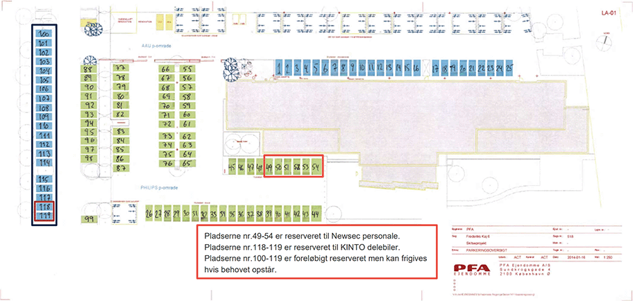

## Parkeringsregler

Der er parkeringsregler på/ved Frederikskaj&nbsp;2. Disse fremgår ved tydelig skiltning, og de bliver håndhævet af [COPARK](https://copark.dk/).

Bemærk at i modsætning til tidligere **omfatter disse parkeringsregler kun grundejerforeningens ejendom**, dvs. bebyggelsen og stikvejen langs denne. Antallet af parkeringspladser er meget begrænset, og der henvises i stedet til parkering [på Frederikskaj&nbsp;6](#parkering-nu-og-i-fremtiden).

### COPARK-app

Beboerne kan parkere gratis, hvis deres køretøj er registreret i COPARKs app til mobiltelefon ([Android](https://play.google.com/store/apps/details?id=no.giantleap.parko.copark)/[iPhone](https://apps.apple.com/dk/app/copark/id1503185040?l=da)). Hver lejlighed har adgang til to permanente parkeringstilladelser enten knyttet til ét telefonnummer eller fordelt på to telefonnumre. Når et telefonnummer er registeret, kan man også registrere køretøjer tilhørende gæster, håndværkere og lignende, som dermed kan holde gratis i 24&nbsp;timer. Man behøver ikke at eje et køretøj for at blive registeret hos COPARK, og dermed har alle beboere mulighed for at oprette midlertidige tilladelser til deres gæster.

### Registrering i app

Som **ejer** på Frederikskaj&nbsp;2 kan man få registreret sit telefonnummer ved at henvende sig til [ejerforeningens bestyrelse](/kontakt/ejerforeningen/) og oplyse **navn**, **adresse** og **telefonnummer**. Som **lejer** skal man kontakte sin udlejer for at blive registreret. Bemærk at man skal forvente en vis sagsbehandlingstid fra man henvender sig til man får tilladelsen.

### Parkering med p-skive

Desuden er der gratis parkering i to timer, såfremt parkeringsskiven er korrekt indstillet.

### Handikap-pladser

Frederikskaj&nbsp;2 har tre handikap-pladser ud for opgang&nbsp;2R, som er klart opmærket. Her må der kun parkeres, hvis man har et gyldigt handikapskilt i forruden. Parkering på handikap-pladserne er derudover underlagt de samme parkeringsregler som resten af området.

## Ingen kørsel i bebyggelsen

Generelt er al motorkørsel inde i bebyggelsen forbudt, som også markeret med skilte ved indkørselsvejene, og derfor er den indre del af bebyggelsen afspærret. Undtagelsen er dog, hvis man har indhentet tilladelse i forbindelse med flytning eller andet.

Ved ind- og udflytning, eller f.eks. aflæsning af større møbler, kan man kontakte [viceværten](/kontakt/vicevaert/) for tilladelse til at køre ind og parkere på vejene foran bygningerne. Viceværten ville i så fald kunne hjælpe med at fjerne pullerterne ved hovedindkørslen. Flyttebiler og lignende skal benytte en fysisk parkeringstilladelse placeret i forruden. Viceværten kan udlåne denne, men anmodning om dette skal ske mindst fem dage før den skal benyttes.

Det er dog aldrig tilladt at køre ind på eller over græs og bede, og en gartnerregning vil følge hvis dette sker.

## <LinkTarget name="parkering-nu-og-i-fremtiden">Parkering nu og i fremtiden</LinkTarget>

Så længe der bygges på grunden mellem vores bebyggelse og det store lyskryds har man som beboer mulighed for at leje en parkeringsplads på Frederikskaj&nbsp;6. Gæster osv. kan endvidere parkere på området mod betaling.

For at leje en parkeringsplads bedes man henvende sig per mail eller telefon på henholdsvis info@plotpark.dk eller 53&nbsp;53&nbsp;25&nbsp;00 i tidsrummet 10:00&ndash;16:00. 

Prisen for at leje en parkeringsplads er kr.&nbsp;700 per måned og lejen betales kvartalsvis forud. Der opkræves et engangsbeløb på kr.&nbsp;100 inkl. moms i oprettelse pr. kontrakt. Parkeringsaftalen kan opsiges skriftligt med et varsel på løbende måned plus én måned.

import referat20220119 from './informationsmoede-om-parkering-2022-01-19.pdf'

Byggeriet forventes at være færdigt i 2025, og herefter vil man som beboer kunne leje en parkeringsplads i det nye byggeri. Ejerforeningen afholdte den 19.&nbsp;januar 2022 et informationsmøde hvor MT Højgaard orienterede om de fremtidige planer for parkering (se <a href={referat20220119} target="_blank">referat</a>).