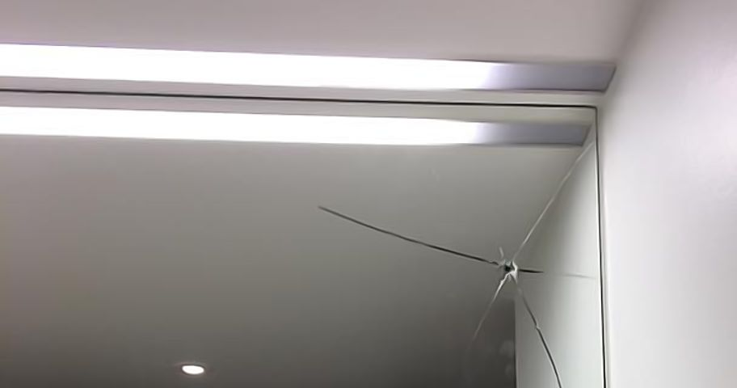
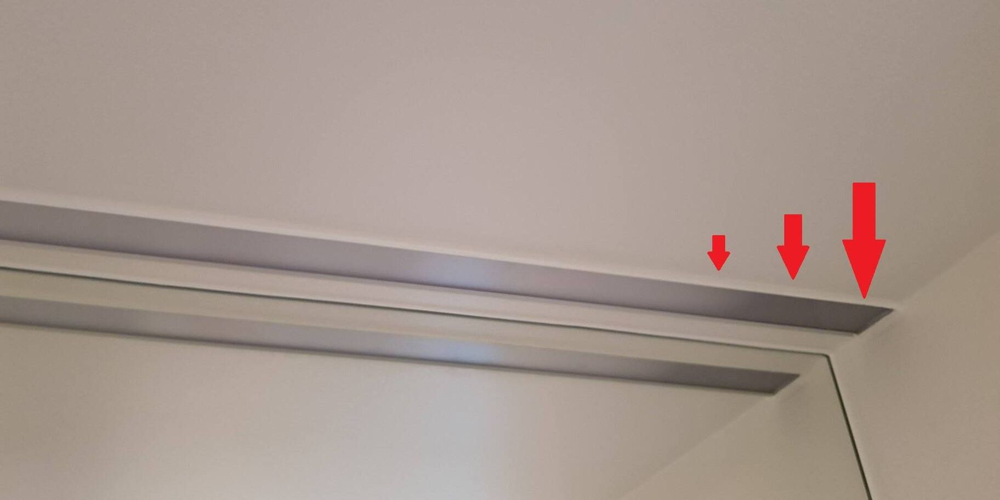
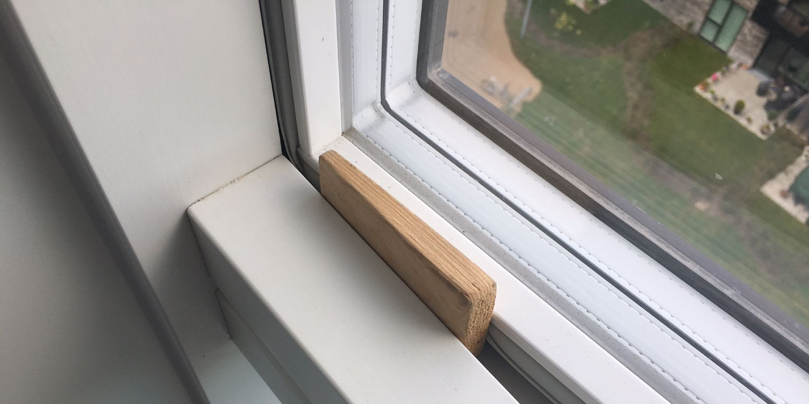

Her finder du information praktiske problemer i lejligheden.

## Bore i væggene ind til badeværelset

Hvis du (imod anbefalingen) ønsker at bore i betonvæggene ind imod badeværelset, så må du:

- Maksimalt bore 4 cm ind, da væggene kun er 6 cm tykke.
- Passe meget på rør- og ledningsføring inde i væggene. Diagram (CAD-tegninger) over rørføringen kan ses i [beboervejledning bilag 4](../beboervejledning/). Der må under ingen omstændigheder bores i områder, hvor der er rør!

## Brug og funktion af WC-tryk

Det væghængte toilet i boligerne er med to skyl &mdash; et lille og et stort.

Der skylles ud ved brug af et af de to pneumatiske WC-tryk, som virker ved, at der trykkes til og holdes inde på knappen inden den slippes. Trykkene virker ikke korrekt, hvis knappen ikke holdes inde førend den slippes.

Der kan opleves problem med utilstrækkeligt sug ud i kummen, hvis ikke der trykkes længe nok på WC-trykket, til at der føres vand nok frem til skyl.

## Skift af lyskilde i lysarmatur over spejl på badeværelset

Datablad på lysarmaturet i badeværelset fortæller fejlagtigt ikke noget om, hvordan man skifter lyskilde, hvis/når den springer.

Bygherren (MTH) oplyser i marts 2019, at hvis det bliver nødvendigt at afmontere afskærmningen af armaturet for at skifte lysstofrøret, så anbefales det, at der benyttes en smal spartel, og at man så »brækker«/løsner afskærmningen ud fra den forreste kant. Start i en af siderne og arbejd dig så hele vejen på tværs, indtil pladen er helt fri. Det svære er at lave det første »bræk« hvor man skal bruge en del kraft, men samtidig skal undgå at ødelægge afskærmningen. Held og lykke!

Hvis det ikke hjælper at skifte lysstofrøret, er det sandsynligvis forkoblingen til lysstofrøret, som skal skiftes.

## Åbning af gadedør med dørtelefon

Åbning af gadedøren via dørtelefonen kan nogen gange være lidt »tricky«, men hvis det gøres som følger, så burde det virke:

1. Når der ringes på, trykkes der én gang på nøgle-symbolet på dørtelefonen. Bare tryk én gang &mdash; ikke holde fingeren på.
2. Gadedøren igangsætter nu en åbnings-sekvens med nogle små »klik«. Som regel kan gadedøren først åbnes ved det tredje klik, så jeres gæster skal lige have nogle sekunders tålmodighed.

## Vindue som klaprer

Hvis dine vinduer ikke har en »lock funktion« og dermed »klaprer« når de er på sikkerhedshaspen, er her følgende billige løsning til et par kiler. De skrammer ikke vindueskarmene, da de er i blødt træ.

10 styk trækiler kan købes i fx Biltema eller Bauhaus for en 15&ndash;17 kroner. Du saver så 5&ndash;7&nbsp;cm af den spidse ende, og pudser kilen med lidt sandpapir. Det virker!

Lav 10 styk og del dem du ikke selv har brug for med din nabo!

