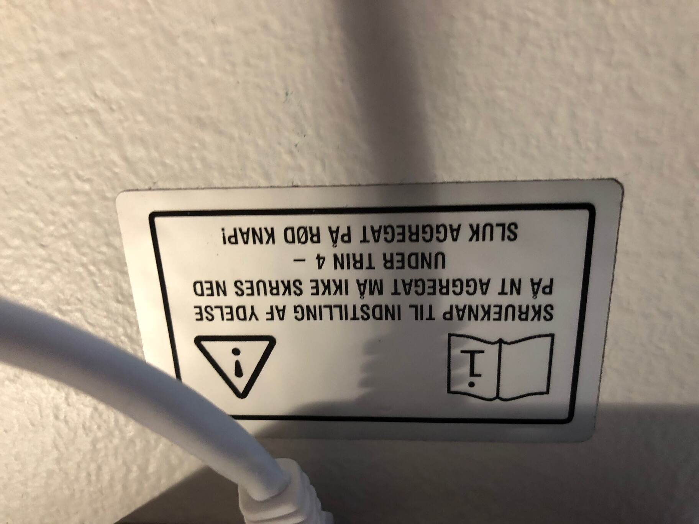

Til hver lejlighed på Frederikskaj&nbsp;2 er der et ventilationsanlæg som skal betjenes og vedligeholdes. Aggregatet er placeret under loftet i depotrummet og er af typen <a href="https://www.vacumex.dk/CustomerData/Files/Folders/16-nt250ec/305_vacumex-nt-260ec-slimline-ventilationsaggregat-08022017.pdf" target="_blank">Vacumex NT260EC-ST-RT3</a>.

Moderne lejligheder er tætte for at de kan efterleve strenge energikrav. Derfor vil der uden ventilationsanlæg ikke ske nogen automatisk udluftning til forskel fra ældre bygninger, som populært sagt er utætte. Udluftningen er vigtig for at holde et godt indeklima og holde luftfugtigheden nede. Ved manglende udluftning kan der opstå fugt og skimmelsvamp. Fugtproblemer viser sig ofte først som dug i vinduerne.

Anlægget suger luft bort via emhætten og et sug på badeværelset. I de øvrige rum bliver der blæst luft ind i lejligheden via runde spjæld. Hvis man ønsker at øge udsugningen fx når man går i bad skal man tænde for emhætten. Når man tænder for emhætten skruer man op for hele anlæggets styrke, og det øger udsugningen både i køkken og bad.

## Justering

Anlægget kan justeres på betjeningspanelets drejeknap. Dog er denne drejeknap blevet fjernet i mange lejligheder i forbindelse med et serviceeftersyn fra leverandørens side for at undgå de skader på anlægget der opstår når man skruer for langt ned.

Har man valgt at behold drejeknappen skal den som standard pege lige op. Her er anlægget i sin basisindstilling som er den indstilling der er blevet opmålt til at opfylde lejighedens krav til luftskifte. Hvis man for eksempel synes at anlægget larmer, kan man skrue ned for drejeknappen (med mindre luftskifte som følge). Her skal man være opmærksom på at det ikke må skrues ned under 4 på drejeknappen, da der er en motor i aggregatet der ikke får den fornødne luft, og man risikerer at denne overopheder og går i stykker.

Anlægget kan også slukkes helt ved tryk på den røde knap på betjeningspanelet. Ved dette er der ikke risiko for overophedning af ovenfornævnte motor, men til gengæld er der ikke noget automatisk luftskifte (ej heller i emhætte eller på badeværelse). **Hvis** der kommer fugt i anlægget (kondens, slagvind) ville det i højere grad blive liggende ved slukket anlæg, da et luftskifte ville fremme fordampningen i anlægget.

Spjældene i rummene er justeret inden overtagelse af lejligheden, og hvis man justerer på et af disse justerer man ikke kun på luftmængderne i det pågældende rum, men også i de øvrige rum. Derfor kan det ikke anbefales at lave justeringer af dette, uden fagfolk der kan måle luftmængden der løber gennem spjældene.

## Vedligehold

Vedligehold af anlægget står alle ejere selv for, og er således ikke ejerforeningens ansvar. Aggregatet skal vedligeholdes ved skift af filter (ved behov, MT&nbsp;Højgaard har sagt hvert halve til hele år) samt servicering og kontrol af aggregat (én gang årligt).

For at se om anlægget har behov for filterskift, skal anlægget køre på max (tænd for emhætten), og kig derefter på betjeningspanelet, og se om den røde filterlampe lyser. Udover vedligehold af selve anlægget, skal fedtfiltrene i emhætten vaskes ved behov.

Ejerforeningen har faciliteret en <a href="lygas-tilbud.pdf" target="_blank">aftale</a> med [OK Energiteknik A/S](https://www.ok-energiteknik.dk/) (tidligere Lygas), som kan sørge for service og filterskift. Man kan som lejlighedsejer melde sig til [ved at kontakte dem på deres hjemmeside](https://www.ok-energiteknik.dk/privat/bestil/ventilationsservice) (mærke er _Vacumex NT260EC-ST-RT3_ og årstal er _2016_). Ud over service og filterskift tilbyder de også grov indregulering for kr.&nbsp;1.000 som kan være nødvendigt hvis man selv har justeret på ventilerne og som et resultat heraf har dårlig ventilation.

Man kan også selv skifte sit filter. Filtre kan købes flere steder, fx hos [Filterhuset.dk](https://www.filterhuset.dk/vacumex/nt-260).

Se i øvrigt [beboervejledningen, bilag 8](/information/beboervejledning/).