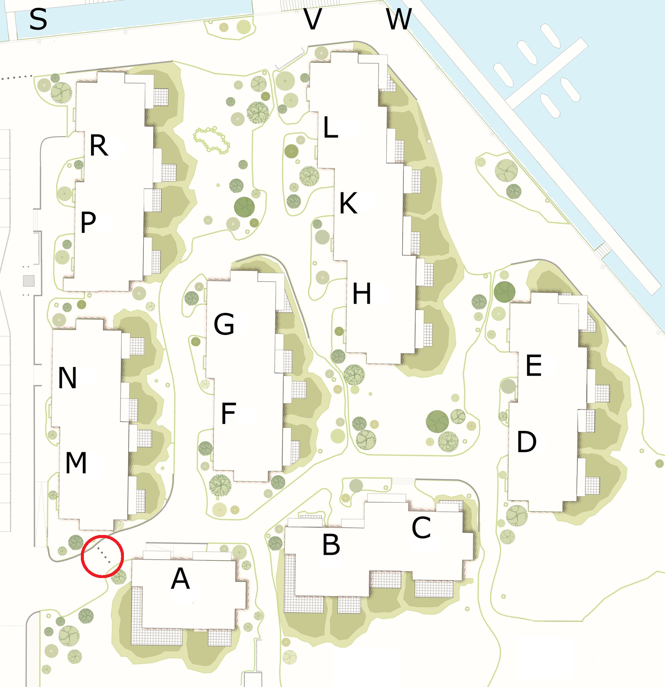

I forbindelse med ind- og udflytning kan man få en parkeringstilladelse til en flyttebil. Ansøgning skal indsendes mindst **fem dage** før dagen for flytningen. Hvis man har brug for en parkeringstilladelse i flere dage skal man lave flere ansøgninger.

Man kan køre langs kajkanten fra Aalborg Universitet København. Det er også muligt at få fjernet pullerterne ved indkørslen til området (se rød cirkel på oversigtskortet nedenfor).

Vær opmærksom på at stierne inde i området flere steder er meget smalle, og eventuelle skader på grønne områder forvoldt af flyttebilen vil blive krævet udbedret.

## Ansøg om parkeringstilladelse

<ContactForm type='flytning' buttonLabel="Send besked">
    <TextInput label="Fulde navn" name="name" required inputProps={{maxLength: 100}} />
    <ApartmentSelect allApartments={true} />
    <TextInput label="E-mail" name="email" type="email" required inputProps={{maxLength: 100}} />
    <TwoFields field1={<DateInput label="Dato" name="date" minRelativeDate='5' required />} field2={<CheckboxInput label="Fjern pullerter (rød cirkel nedenfor)" name="toggle1" />} />
    <TextInput label="Registreringsnummer" name="subject" required inputProps={{maxLength: 20}} />
</ContactForm>

