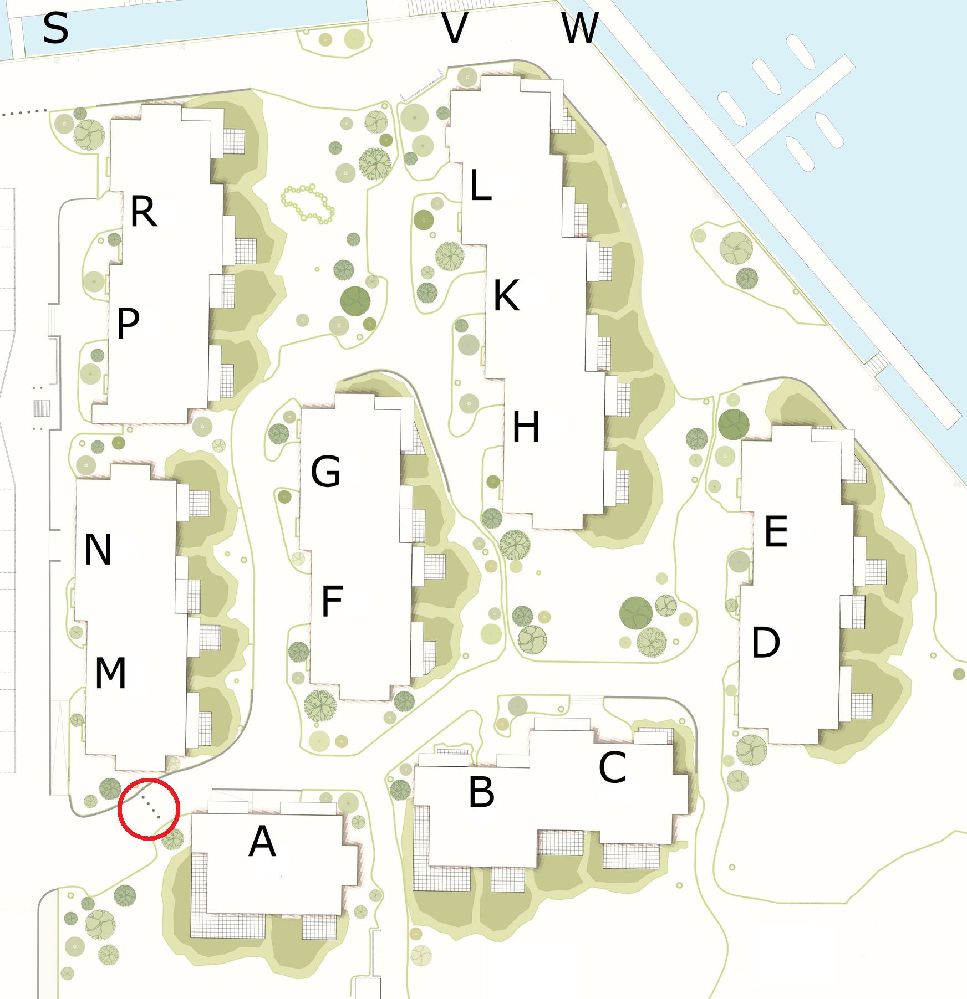

I forbindelse med flytning eller levering af større genstande til boligen kan man få tilladelse til at parkere et køretøj foran ens opgang. Ansøgning skal indsendes mindst **to dage** før. Hvis man har brug for en tilladelse i flere dage skal man lave flere ansøgninger.

Man kan køre langs kajkanten fra Aalborg Universitet København. Det er også muligt at åbne pullerterne ved indkørslen til området (rød cirkel på oversigtskortet nedenfor).

Vær opmærksom på at stierne inde i området flere steder er meget smalle, og eventuelle skader på grønne områder forvoldt af køretøjet vil blive krævet udbedret for beboerens regning.

## Åbning af pullerter

I affaldsrummet ved hver opgang på Frederikskaj&nbsp;2 findes en trekantsnøgle, der passer til områdets pullerter. Det er beboernes eget ansvar at bruge nøglen og sætte pullerterne på plads igen efter brug.

## Anmod om tilladelse til parkering ved flytning

Oplys **registreringsnummer** på køretøjet. Hvis du ikke kender registreringsnummeret, skal du beskrive køretøjet, så det kan genkendes af p-vagten.

Anmodningen sendes til Copark. I tvivlstillfælde kan man rette henvendelse til Copark på telefon 42&nbsp;90&nbsp;50&nbsp;10.

<ContactForm type="flytning" buttonLabel="Send besked">
    <TextInput label="Fulde navn" name="name" required inputProps={{ maxLength: 100 }} />
    <ApartmentSelect allApartments={true} />
    <TextInput label="E-mail" name="email" type="email" required inputProps={{ maxLength: 100 }} />
    <DateInput label="Dato" name="date" minRelativeDate="2" required />
    <TextInput label="Registreringsnummer eller beskrivelse" name="subject" helperText="Fx »XY&nbsp;12&nbsp;345«, »Flyttefirma&nbsp;X« eller »Udlejning&nbsp;Y«" required inputProps={{ maxLength: 50 }} />
</ContactForm>

